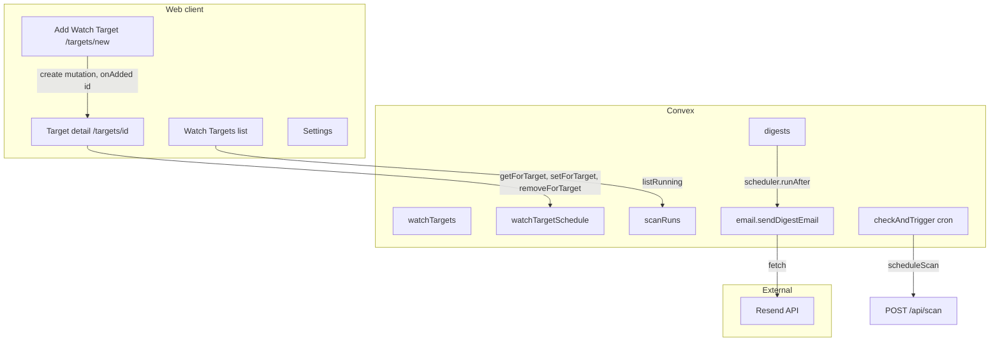

# Compass — High-Level Design (HLD)

This document describes the high-level architecture of Compass: major components, data flow, and integration points. It is kept in sync with the codebase when changes are requested (see [AGENTS.md](../AGENTS.md)).

---

## 1. System context

Compass is a competitive intelligence monitoring app for biotech teams. Users define watch targets (drugs, targets, companies), run scans across public data sources, and consume synthesized digests. The system comprises:

- **Web app (Next.js App Router):** Dashboard, watch target management, settings, digest/timeline views, chat.
- **Backend (Convex):** Auth, persistence, queries/mutations, scheduled jobs (cron), and server-side actions (e.g. HTTP outbound).
- **Scan pipeline:** Next.js API route (`POST /api/scan`) plus Convex mutations for run lifecycle; source agents run in-process or via external APIs (PubMed, ClinicalTrials.gov, EDGAR, Exa, etc.).
- **Digest pipeline:** After a scan completes with new items, digest content is generated (in API route or Convex action) and stored; side effects (Slack, email) are triggered via Convex scheduler.

---

## 2. Major components

| Component | Responsibility |
|-----------|----------------|
| **Frontend (app/, components/)** | Pages, forms, navigation. All data via Convex React hooks. |
| **Convex (convex/)** | Schema, queries, mutations, internal mutations, actions, crons. Single deployment unit. |
| **Scan API (app/api/scan)** | Accepts scan requests (manual or from Convex), runs source agents, writes raw items and digest. |
| **Schedule parse API (app/api/schedule/parse)** | Parses natural-language schedule strings into structured daily/weekly/timezone for Convex. |
| **Resend (external)** | Email delivery for digest notifications; invoked from Convex action via REST API. |

---

## 3. Data flow (relevant to recent features)

### 3.1 Add watch target and redirect

- User submits "Add Watch Target" from `/targets/new`.
- Frontend calls `watchTargets.create` mutation; mutation returns new `Id<"watchTargets">`.
- Frontend receives ID in `onAdded(id)` and navigates to `/targets/${id}`.
- No new backend flows; only callback contract and client-side navigation.

### 3.2 Scan visibility and per-target schedule

- **Running scans:** The **Watch Targets** page (`/targets`) is the control center for scan status. It shows all scan runs that are pending or running for the current user's targets, via the `scans.listRunning` query. Each row displays status, scheduled/started time, target names, and source progress (e.g. 3/7 sources). The list updates reactively as runs complete or fail.
- **Per-target schedule:** One optional row per target in `watchTargetSchedule`. Cron `checkAndTrigger` evaluates `watchTargetSchedule` rows and, when due, calls `scheduleScan` with a single target ID.
- Schedule configuration lives only on the **individual watch target page** (collapsible “Scan schedule” section). User enters natural language + timezone; frontend calls `/api/schedule/parse` then `scanSchedule.setForTarget` or `removeForTarget`.

### 3.3 Digest creation and email

- Digest is created in one of two ways: (1) from the Next.js scan API after a successful scan with new items (`createDigestRunWithItemsFromServer`), or (2) from a Convex action (`createDigestRunWithItems`).
- Both creation paths, after persisting the digest run and items, schedule an internal action: `ctx.scheduler.runAfter(0, internal.email.sendDigestEmail, { digestRunId })`.
- **sendDigestEmail** (Convex action, `"use node"`): Loads digest run → scan run → first target → user; reads `user.email`; if `RESEND_API_KEY` is set, POSTs to Resend API to send one email with summary and link to target’s digest page. No DB writes; best-effort delivery.

---

## 4. External integrations

| Integration | Purpose | Direction |
|-------------|---------|-----------|
| **WorkOS AuthKit** | Sign-in, session, JWT for Convex | Inbound (auth), Outbound (token validation) |
| **Resend** | Digest notification email | Outbound (Convex action → `https://api.resend.com/emails`) |
| **Slack** | Digest delivery (Block Kit) | Outbound (Convex or app) |
| **PubMed, ClinicalTrials.gov, EDGAR, Exa, openFDA, RSS** | Scan data sources | Outbound from scan pipeline |

---

## 5. Non-functional and cross-cutting

- **Event-driven side effects:** Domain events (e.g. digest created) trigger downstream work via Convex scheduler or internal actions, not inline in the same mutation or API handler. See AGENTS.md § Event-driven side effects.
- **Auth and scoping:** Convex queries/mutations that expose user data use `getUserIdFromIdentity` or `getOrCreateUserId`; internal queries/actions used by crons or email have no user context and resolve ownership via stored IDs (e.g. `watchTargets.userId` → `users.email`).
- **Convex env:** Keys such as `RESEND_API_KEY`, `APP_URL`, `RESEND_FROM_EMAIL` are set in Convex (e.g. `npx convex env set`), not in Next.js `.env.local`.

---

## 6. Diagram (overview)

