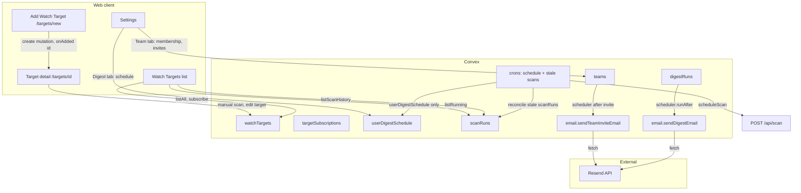

# Compass — High-Level Design (HLD)

This document describes the high-level architecture of Compass: major components, data flow, and integration points. It is kept in sync with the codebase when changes are requested (see [AGENTS.md](../AGENTS.md)). Historical scaffold / phase notes may appear under [`docs/plans/`](plans/).

**Arrow of intent (design chain):** **HLD** (system context, data flow, integrations) → **LLD** (modules, Convex/API contracts, env, operations) → **EARS** (testable “shall” requirements). **Presentation** (layout, component patterns, Settings tab chrome): **[`docs/styleguide.md`](styleguide.md)** — keep aligned when UI changes; Settings has an explicit traceability table there (EARS ↔ HLD §4.2 ↔ LLD ↔ styleguide). Changes should flow *down* the chain: update HLD when architecture shifts, LLD when contracts or files change, EARS when user-visible behavior or constraints change, styleguide when visual or IA patterns change. **Traceability:** EARS §8 links back here, to LLD, and to the styleguide.

---

## 1. System context

Compass is a competitive intelligence monitoring app for biotech teams. Users define watch targets (drugs, targets, companies, researchers/faculty), run scans across public data sources, and consume synthesized digests. The system comprises:

- **Web app (Next.js App Router):** Watch Targets (hub), target detail, settings, digest/timeline views, chat. Navigation: Watch Targets | Chat | Settings. Home (`/`) redirects to `/targets` for signed-in users. Dashboard and History are legacy redirects to `/targets`.
- **Backend (Convex):** Auth, persistence, queries/mutations, scheduled jobs (cron), and server-side actions (e.g. HTTP outbound).
- **Scan pipeline:** Next.js API routes **`POST /api/scan`** (full or filtered sources) and **`POST /api/scan/pubmed`** (PubMed-only, one watch target; same server auth as `/api/scan`), plus Convex mutations for run lifecycle; source agents run in-process or via external APIs (PubMed, ClinicalTrials.gov, EDGAR, Exa, etc.). Shared implementation: `lib/scan/runScanPipeline.ts`, `lib/scan/scanAuth.ts`.
- **Digest pipeline:** After a scan completes with new items, digest content is generated (in API route or Convex action) and stored; side effects (Slack, email) are triggered via Convex scheduler.

---

## 2. Watch target types

Compass supports four types of watch targets:

| Type | Description | Example |
|------|-------------|---------|
| **Drug** | Pharmaceutical compounds, molecules | "Semaglutide", "REGN5381" |
| **Target** | Biological targets (proteins, pathways) | "NPR1", "B7-H3" |
| **Company** | Biotech/pharma companies | "Regeneron", "Moderna" |
| **Person** | Researchers, faculty, KOLs | "Jennifer Doudna" |

Person-type targets are scanned for publications and news mentioning the researcher's name. They include an optional `affiliation` field for institutional context (e.g., "Stanford University").

---

## 3. Major components

| Component | Responsibility |
|-----------|----------------|
| **Frontend (app/, components/)** | Pages, forms, navigation. All data via Convex React hooks. |
| **Convex (convex/)** | Schema, queries, mutations, internal mutations, actions, crons. Single deployment unit. |
| **Scan API (`app/api/scan`, `app/api/scan/pubmed`)** | **`POST /api/scan`:** manual UI, Re-run, and Convex `callScanApi`. Optional **`lookbackDays`** (default **14** calendar days; **`0`** = no recency cutoff for digest input or inbound upserts): when **> 0**, digest synthesis and upserts consider only rows whose effective time is within the last **N** calendar days (**`publishedAt`**, else **`_creationTime`**); inbound rows **without** `publishedAt` are dropped (no date = cannot confirm recency; downstream fallback to `_creationTime` would make them appear falsely recent). When **`pubmedPubDate` is omitted** and **`lookbackDays` > 0**, PubMed **`esearch`** uses a **`pdat`** range from **today − N days** through **today** (UTC); when **`pubmedPubDate` is omitted** and **`lookbackDays` is `0`**, PubMed **retrieval** uses the default **contemporaneous** (**3-year**) **`pdat`** window instead of the last-**N**-days range. ClinicalTrials.gov queries use **`filter.advanced`** with an **`AREA[LastUpdatePostDate]RANGE[<mindate>,MAX]`** clause when **`lookbackDays` > 0**, filtering server-side to recently updated trials; `publishedAt` is extracted as **`lastUpdatePostDateStruct`** (last posted update) → **`studyFirstPostDateStruct`** (first posted) → **`startDateStruct`** (enrollment start) in priority order. **`POST /api/scan/pubmed`:** programmatic PubMed-only scan for one `watchTargetId` (optional `period`, `mode`, `pubmedPubDate`, `lookbackDays`); same `SCAN_SECRET` / Bearer auth. If the client supplies **`pubmedPubDate`**, it controls PubMed **`esearch`** dates; **`lookbackDays`** still controls digest input and inbound filtering when **> 0**. PubMed publication-date filters are server-side, not LLM-supplied. Both routes use shared pipeline code; run source agents, write raw items and digest when applicable. |
| **Cross-target graph (Convex)** | After a successful scan, reconciles `graphCrossTargetEdges` when the same `source` + `externalId` appears under two or more watch targets in the same workspace (`team` or `user` scope). The Watch Targets hub **Connections** tab subscribes to **`crossTargetGraph.listEdgesForViewer` only** when that tab is active **and** the hub has **at least one** loaded watch target; it **groups** edges by **target pair**, **auto-selects the first pair** when edges exist, loads evidence via **`rawItems.getByIds`**, and **deduplicates** shared links **by URL** in the Shared sources column. |
| **Schedule parse API (app/api/schedule/parse)** | Parses natural-language schedule strings into structured daily/weekly/timezone for Convex. |
| **Resend (external)** | Email delivery for digest notifications; invoked from Convex action via REST API. |

---

## 4. Data flow (relevant to recent features)

### 4.1 Add watch target and redirect

- User submits "Add Watch Target" from `/targets/new`.
- Frontend calls `watchTargets.create` mutation; mutation returns new `Id<"watchTargets">`.
- Frontend receives ID in `onAdded(id)` and navigates to `/targets/${id}`.
- No new backend flows; only callback contract and client-side navigation.

### 4.2 Scan visibility and schedules

- **Running scans:** The **Watch Targets** page (`/targets`) is the control center for scan status. It shows all scan runs that are pending or running for targets the user can see (owned or same-team), via `scans.listRunning`. Each row displays status, scheduled/started time, target names, and source progress (e.g. 3/7 sources). The list updates reactively as runs complete or fail. Users may **dismiss** a stuck run (`scans.dismissStuckScanRun`), which marks it failed so it leaves the list. **Stale reconciliation:** a Convex cron runs `scans.reconcileStaleScanRuns` **every 15 minutes**; runs left `pending` more than **1 hour** after `scheduledFor`, or `running` more than **30 minutes** after `startedAt` (or `scheduledFor` if `startedAt` is unset), are marked `failed` with a system message and incomplete per-source rows are closed out (covers Next.js timeouts, crashes, or a stuck bridge). **`POST /api/scan`** and **`POST /api/scan/pubmed`** mark the run (and incomplete sources) `failed` when the handler throws after a run id exists, so the DB does not stay `running` after a 500.
- **Recent scans (history):** On the same page, **completed** and **failed** scan runs for visible targets are loaded via `scans.listScanHistory` (newest by `completedAt` / `startedAt` / `scheduledFor`) **only when** the user opens the **Recent scans** sidebar tab **and** has at least one watch target (the client skips the query on the default tab). They appear in that tab (not the default tab); see styleguide. Rows are grouped by **calendar month** (month label, see styleguide). Each row shows outcome, time, period (daily/weekly), target names, counts (or failure reason), and **View digest** when a `digestRuns` row exists for that `scanRunId`. **Failed** rows with `targetIds` offer **Re-run**: clicking it **hides** that row’s stored failure text in the UI immediately (the history document is unchanged); same-origin **`POST /api/scan`** (browser `fetch`, no `scanRunId`) with that run’s `period` and `targetIds` and `mode: "comprehensive"` — same comprehensive scan path as manual **Run scan** from target cards (cards on this hub always send **`daily`** period; retry preserves the row’s **daily** or **weekly**). The route creates a **new** run; feedback is inline on the panel; if the request fails, the row’s failure text is shown again. No new Convex client API for retry.

**Watch Targets hub (scan blocks, schematic):**

```text
[H1 Watch Targets]
[Sidebar tabs: Targets | Recent scans | Connections]   default: Targets
  Targets panel:
    [+ Add Watch Target]
    [In your digest] / [Team-wide targets]   when on a team; else [Watch targets]
    [Running scans]     optional card — pending / running rows (after lists)
  Recent scans panel:
    [Completed & failed history only]   month groups + digest link + Re-run on failed rows; no target lists
  Connections panel:
    [Target pairs | Shared sources]   one row per pair (aggregated); first pair auto-selected when edges load; dedupe URLs in evidence; Refresh graph; empty if < 2 targets
```

- **Cross-target connections (graph, Phase 1):** `rawItems` are deduplicated **per watch target** (`source` + `externalId` + `watchTargetId`). When `scans.updateScanStatusFromServer` sets a run to **`completed`**, Convex schedules **`internal.crossTargetGraph.reconcileForWatchTargets`** for that run’s `targetIds`, which upserts **`graphCrossTargetEdges`** for pairs of targets in the same scope (`team:<id>` or `user:<id>`) that share a document key (`source:externalId`). The client subscribes to **`crossTargetGraph.listEdgesForViewer` only** when the **Connections** tab is selected **and** `targets.length >= 1` (other tabs and the zero-target case skip the query). **`crossTargetGraph.scheduleReconcileForMyVisibleTargets`** backfills from all visible targets (**Refresh graph**). The client **groups** flat edges by watch-target **pair** for the left column; **when** any pairs exist, it **selects the first pair** by default (most recently updated) until the user picks another. The right column uses **`rawItems.getByIds`** (auth-scoped) on merged ids for the selected pair and **collapses duplicate URLs** when rendering.

- **Digest schedule (Settings only):** Optional one row per user in `userDigestSchedule`. Cron `checkAndTrigger` evaluates **only** these rows, groups due users by **team** + local time slot (users without a `teamId` are keyed **per user**, not merged across accounts), merges subscribed active targets and notify users, and calls `scheduleScan` once with `digestNotifyUserIds` so teammates at the same slot share one scan. There is **no** per-target automatic schedule table or cron path.
- **Settings UI:** Sidebar tabs (**Team** | **Digest schedule**); default tab **Team**; `?teamInvite=` handled under `Suspense`, with success/error surfaced on the Team tab. Digest panel: natural language + timezone → `/api/schedule/parse` → `userDigestSchedule.set` / `remove`, plus per-user **Decision brief** email preference (`inherit` \| `enabled` \| `disabled`) on `users.decisionBriefPreference`, and **digest email source recency** (**7** / **14** / **30** / **60** / **90** calendar days) on `users.digestEmailLookbackDays` (defaults to **14** when unset). **Layout, ARIA, and breakpoints:** [`docs/styleguide.md`](styleguide.md) §6 (Settings page).
- **Target detail:** Explains that automatic timing is configured on Settings; manual “Run scan” remains on the target page. **Source Links** and **Timeline** default to a **14-day** recency window (URL `range=` / Convex `lookbackDays`); users can switch to **7d**, **30d**, or **All** with the same pill pattern on both views.

### 4.3 Digest creation and email

- Digest is created in one of two ways: (1) from the Next.js scan API after a successful scan with new items (`createDigestRunWithItemsFromServer`), or (2) from a Convex action (`createDigestRunWithItems`).
- **Decision Digest (optional):** Decision Digest generation is **on by default** for `POST /api/scan` (unless explicitly disabled with `DECISION_DIGEST_ENABLED=false`) and may persist extra fields on `digestRuns`: `deltaSummary`, `materialitySummary`, `strategicReadSummary`, `recommendedActionsSummary`, and `confidence` (`low` \| `medium` \| `high`). Older runs omit these fields. The digest detail page shows a **Decision brief** card when any are present. For scheduled combined runs, recipient-level preferences (`users.decisionBriefPreference`) can override system default intent for generation (if at least one recipient resolves to enabled, generation runs when Groq is available). **sendDigestEmail** includes the same block in HTML when present, but visibility is resolved per recipient preference.
- **Digest item workflow:** Each `digestItems` row may have `workflowStatus` (`open` \| `in_review` \| `resolved`), optional `assigneeUserId`, and `workflowUpdatedAt`. Comments live in `digestItemComments` (author + body + time). Mutations require `canViewWatchTarget` for the item’s watch target; assignee must be the target owner or a user on the same `teamId` as the target.
- Both creation paths, after persisting the digest run and items, schedule an internal action: `ctx.scheduler.runAfter(0, internal.email.sendDigestEmail, { digestRunId })`.
- **sendDigestEmail** (Convex action, `"use node"`): Loads digest run, scan run, all digest items, and target names; batch-loads linked **`rawItems`** via **`getByIdsInternal`** to filter each recipient’s signals by **source recency** using **`digestItemQualifiesBySourceRecency`** (**`lib/scan/lookback`**): cutoff from **`digestRun.generatedAt`** minus **`clampDigestEmailLookbackDays(user.digestEmailLookbackDays)`** calendar days (**`publishedAt ?? _creationTime`** on linked rows; **`empty`** `rawItemIds` ⇒ item kept). **`getSubscribedWatchTargetIdsForUserInternal`** restricts targets for users with **`teamId`** (no team ⇒ all targets in the run). **`buildDigestEmailHtml`** headings use **N** = that clamped preference and include a brief line that the window reflects **linked-source** publication or ingestion time, distinct from **`POST /api/scan`** `lookbackDays` alone. If `digestNotifyUserIds` is set, sends one HTML email per deduplicated user in that list. **Executive summary** and **Decision brief** are omitted when **no** items remain after that recency filter (avoids misleading run-wide copy). Per-target sections are rendered for **every** in-scope target — either in-window signal cards or a **nothing new in the last N days** line. Internal app links and external source links are validated to safe `http`/`https` `href` values before rendering. Otherwise resolves recipient from the first target’s owner. If `RESEND_API_KEY` is set, POSTs to Resend; non-OK responses throw so failures surface in Convex logs/retries.
- **sendTeamInviteEmail** (internal action): After `teams.inviteTeamMemberByEmail`, scheduled with `inviteId`; loads invite context and sends Resend HTML with **Accept** link to `{APP_URL}/settings?teamInvite={token}` when `RESEND_API_KEY` is set; otherwise logs skip (invite still valid for in-app accept).

### 4.4 Teams and subscriptions

- **No domain auto-team:** Sign-in does **not** assign `teamId`. Users join a workspace by **creating a team** (they become `ownerUserId` / admin) or **accepting an email invite** from Settings. Optional `teams.runTeamBootstrap` (with `MIGRATION_SECRET`) can still backfill domain-based teams for legacy data.
- **Settings → Team:** **Create team**, **Invite teammate by email** (admins; Resend email with accept link when configured), **Rename team** (admins only), **Leave team** (ownership transfers to another member when possible). Pending invites stored in `teamEmailInvites` (token, normalized email, TTL); recipients accept via link (`/settings?teamInvite=`) or **Pending invitations** on Settings when signed in with the invited email.
- Watch targets created while on a team get `teamId` and `createdByUserId`; the creator is auto-subscribed in `targetSubscriptions`.
- Teammates see all team targets on `/targets`, toggle **In digest** to subscribe, and receive filtered combined emails from shared multi-target scans. **Ownership:** the row’s `userId` is the only account that may edit or delete that target; others are viewers/subscribers. Legacy rows with a missing `userId` or `createdByUserId` may be backfilled via `watchTargets.backfillWatchTargetOwnership` (`MIGRATION_SECRET`).

### 4.5 Raw-item summaries (timeline and overlay)

- Source agents (e.g. SEC EDGAR) can fetch document content and produce substantive summaries (stored in `rawItems.abstract`) using full watch-target context (name, type, company, notes). The timeline and source-link overlay display these when present, so users see what the filing or article discloses rather than only the title or a generic form/date line. See LLD §4.2–§4.2.1 (scan routes) and EARS §4.5.

---

## 5. External integrations

| Integration | Purpose | Direction |
|-------------|---------|-----------|
| **WorkOS AuthKit** | Sign-in, session, JWT for Convex | Inbound (auth), Outbound (token validation) |
| **Resend** | Digest notification email | Outbound (Convex action → `https://api.resend.com/emails`) |
| **Slack** | Digest delivery (Block Kit) | Outbound (Convex or app) |
| **PubMed, ClinicalTrials.gov, EDGAR, Exa, openFDA, RSS** | Scan data sources | Outbound from scan pipeline |

### 5.1 Offline diff eval (developer)

- **`eval/diff/`** holds golden **before/after** text cases and optional `expected_changes.json` for substring checks.
- **`npm run diff-eval`** (`scripts/diff-eval.ts`) supports `capture` (PubMed procedural snapshot by date **range**), `make-case`, `run` (LLM diff summary), `score`, and `report`. See [`eval/diff/README.md`](eval/diff/README.md).

---

## 6. Non-functional and cross-cutting

- **Event-driven side effects:** Domain events (e.g. digest created) trigger downstream work via Convex scheduler or internal actions, not inline in the same mutation or API handler. See AGENTS.md § Event-driven side effects.
- **Auth and scoping:** Convex queries/mutations use `getUserIdFromIdentity` / `getOrCreateUserId` plus `canViewWatchTarget` (see same team) / `getVisibleWatchTargetIds` for visibility. **Watch target writes** (`watchTargets.update` / `remove`) require **`isWatchTargetOwner`** (`userId` on the row). Crons and email resolve recipients via `digestNotifyUserIds`, subscriptions, and target ownership.
- **Convex env:** Keys such as `RESEND_API_KEY`, `APP_URL`, `RESEND_FROM_EMAIL`, and **`SCAN_SECRET`** (must match Next.js) are set in Convex (e.g. `npx convex env set`). **`APP_URL`** must be a URL Convex can reach when calling `POST /api/scan` (deployed app or tunnel for remote Convex + local Next). **`POST /api/scan/pubmed`** uses the same **`SCAN_SECRET`** for Bearer auth; scheduled digests still call **`POST /api/scan`** only.
- **Digest synthesis (product intent):** Keep synthesis concise and factual; group related source records into one signal when appropriate; calibrate significance (`critical` / `high` / `medium` / `low`); avoid generic “strategic implication” text unless specific; track token/cost where implemented.
- **Risks (design):** API rate limits → backoff and source health; high item volume → cap inputs or staged synthesis; dedup false positives → compare meaningful fields for “changed”; long-running scans → isolated per-source work and runtime budgets.
- **Preview deployments (Vercel + Convex):** Each PR gets a Vercel preview deployment and a fresh Convex preview backend. Build command `npx convex deploy --cmd 'npm run build'` auto-detects the deploy key type: **Production** key → deploys to production Convex; **Preview** key → creates a per-branch Convex preview deployment. `NEXT_PUBLIC_CONVEX_URL` is set by the deploy command before the Next.js build so the frontend connects to the correct backend. **WorkOS AuthKit:** wildcard redirect URIs registered in WorkOS (`compass-*-ericmjl.vercel.app/callback`) cover all Vercel preview URLs; `next.config.ts` sets `NEXT_PUBLIC_WORKOS_REDIRECT_URI` from `VERCEL_URL` at build time so preview deployments use their own callback URL. The JWT issuer (`convex/auth.config.ts` and `/api/convex-token`) is constant across environments — preview Convex deployments receive the same `auth.config.ts`, so JWT verification works without per-environment configuration. Preview deployments share the same `CONVEX_JWT_PRIVATE_KEY` as production (same key pair, same JWKS). Preview Convex backends are empty (no data, no crons, no env vars unless project-level defaults are set in the Convex dashboard).

---

## 7. Diagram (overview)


```mermaid
flowchart TB
  subgraph client [Web client]
    TargetsPage[Watch Targets list]
    NewTarget[Add Watch Target /targets/new]
    TargetDetail[Target detail /targets/id]
    Settings[Settings]
  end

  subgraph convex [Convex]
    WT[watchTargets]
    Teams[teams]
    Subs[targetSubscriptions]
    UDS[userDigestSchedule]
    scanRuns[scanRuns]
    digestRuns[digestRuns]
    EmailAction[email.sendDigestEmail]
    InviteEmail[email.sendTeamInviteEmail]
    Cron[crons: schedule + stale scans]
  end

  subgraph external [External]
    Resend[Resend API]
  end

  NewTarget -->|create mutation, onAdded id| TargetDetail
  TargetDetail -->|manual scan, edit target| WT
  Settings -->|Digest tab: schedule| UDS
  Settings -->|Team tab: membership, invites| Teams
  Teams -->|scheduler after invite| InviteEmail
  InviteEmail -->|fetch| Resend
  TargetsPage -->|listAll, subscribe| WT
  TargetsPage -->|listRunning| scanRuns
  TargetsPage -->|listScanHistory| scanRuns
  Cron -->|userDigestSchedule only| UDS
  Cron -->|reconcile stale scanRuns| scanRuns
  Cron -->|scheduleScan| ScanAPI[POST /api/scan]
  digestRuns -->|scheduler.runAfter| EmailAction
  EmailAction -->|fetch| Resend
```

---

## 8. Operational troubleshooting (summary)

Detailed CLI commands and log line references live in **LLD §8**. Use this section as a mental model.

### 8.1 Scheduled scans and scan HTTP routes

- **Convex logs** (`npx convex logs`, optionally `--prod` for production deployment) show whether the cron ran, `scans:callScanApi` was invoked, and HTTP status from your app (**`POST /api/scan`**).
- **Missing `APP_URL` or `SCAN_SECRET` in Convex** → Convex never successfully calls Next.js; set both in Convex env; **`SCAN_SECRET`** must match Next.js / Vercel.
- **`callScanApi` 401** → secret mismatch between Convex and Next.js.
- **`callScanApi` 500** → Next.js threw; the real message is in the **Next.js** process (terminal running `npm run dev` or **Vercel function logs**), typically a line like `[POST /api/scan] error:`. The scan run should be patched to **`failed`** when the route could associate an error with a `scanRunId`; if something still shows as running, the **stale-scan cron** (every **15 minutes**) or **Dismiss** on Watch Targets clears it.
- **Programmatic PubMed-only:** **`POST /api/scan/pubmed`** uses the same **`SCAN_SECRET`** and shared pipeline; check logs for `[POST /api/scan/pubmed]` on failures (same **`failed`** run semantics as **`POST /api/scan`** once a `scanRunId` exists).
- **Nothing runs at the chosen time** → Confirm a **`userDigestSchedule`** row for the user, timezone/slot, and (team mode) **subscribed** active targets or (solo) owned active targets.

### 8.2 Digest email (production)

- Ensure **`RESEND_API_KEY`**, **`RESEND_FROM_EMAIL`**, and **`APP_URL`** are set on the **same Convex deployment** the app uses (`npx convex env list --prod`). Inspect **`email:sendDigestEmail`** in logs for `started`, `skipping`, `sending`, `sent successfully`, or `Resend API error` (see LLD §8 table).

### 8.3 “Watch targets disappeared”

- Usually **not** data loss: after team changes, **`watchTargets.listAll`** intentionally returns the **union** of targets you **own** (`userId`) and your **current team pool** (`teamId`), so owned rows with a **stale** `teamId` still appear. Detail pages align with **`getVisibleWatchTargetIds`** / **`canViewWatchTarget`**. Optional hygiene: patch `watchTargets.teamId` to the current team for sharing with teammates.

### 8.4 Slack digest (when enabled)

- Block Kit messages typically include a header (daily/weekly), executive summary, per-item blocks (significance, category, headline, synthesis, sources), optional strategic callout, and actions to open the full digest / settings in the web app.
