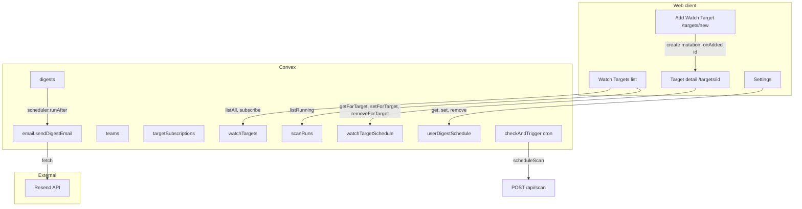

# Compass — High-Level Design (HLD)

This document describes the high-level architecture of Compass: major components, data flow, and integration points. It is kept in sync with the codebase when changes are requested (see [AGENTS.md](../AGENTS.md)).

---

## 1. System context

Compass is a competitive intelligence monitoring app for biotech teams. Users define watch targets (drugs, targets, companies, researchers/faculty), run scans across public data sources, and consume synthesized digests. The system comprises:

- **Web app (Next.js App Router):** Watch Targets (hub), target detail, settings, digest/timeline views, chat. Navigation: Watch Targets | Chat | Settings. Home (`/`) redirects to `/targets` for signed-in users. Dashboard and History are legacy redirects to `/targets`.
- **Backend (Convex):** Auth, persistence, queries/mutations, scheduled jobs (cron), and server-side actions (e.g. HTTP outbound).
- **Scan pipeline:** Next.js API route (`POST /api/scan`) plus Convex mutations for run lifecycle; source agents run in-process or via external APIs (PubMed, ClinicalTrials.gov, EDGAR, Exa, etc.).
- **Digest pipeline:** After a scan completes with new items, digest content is generated (in API route or Convex action) and stored; side effects (Slack, email) are triggered via Convex scheduler.

---

## 2. Watch target types

Compass supports four types of watch targets:

| Type | Description | Example |
|------|-------------|---------|
| **Drug** | Pharmaceutical compounds, molecules | "Semaglutide", "REGN5381" |
| **Target** | Biological targets (proteins, pathways) | "NPR1", "B7-H3" |
| **Company** | Biotech/pharma companies | "Regeneron", "Moderna" |
| **Person** | Researchers, faculty, KOLs | "Jennifer Doudna" |

Person-type targets are scanned for publications and news mentioning the researcher's name. They include an optional `affiliation` field for institutional context (e.g., "Stanford University").

---

## 3. Major components

| Component | Responsibility |
|-----------|----------------|
| **Frontend (app/, components/)** | Pages, forms, navigation. All data via Convex React hooks. |
| **Convex (convex/)** | Schema, queries, mutations, internal mutations, actions, crons. Single deployment unit. |
| **Scan API (app/api/scan)** | Accepts scan requests (manual or from Convex), runs source agents, writes raw items and digest. |
| **Schedule parse API (app/api/schedule/parse)** | Parses natural-language schedule strings into structured daily/weekly/timezone for Convex. |
| **Resend (external)** | Email delivery for digest notifications; invoked from Convex action via REST API. |

---

## 4. Data flow (relevant to recent features)

### 3.1 Add watch target and redirect

- User submits "Add Watch Target" from `/targets/new`.
- Frontend calls `watchTargets.create` mutation; mutation returns new `Id<"watchTargets">`.
- Frontend receives ID in `onAdded(id)` and navigates to `/targets/${id}`.
- No new backend flows; only callback contract and client-side navigation.

### 3.2 Scan visibility and schedules

- **Running scans:** The **Watch Targets** page (`/targets`) is the control center for scan status. It shows all scan runs that are pending or running for targets the user can see (owned or same-team), via `scans.listRunning`. Each row displays status, scheduled/started time, target names, and source progress (e.g. 3/7 sources). The list updates reactively as runs complete or fail.
- **Global digest schedule (Settings):** Optional one row per user in `userDigestSchedule`. Cron `checkAndTrigger` groups due rows by team + local time slot, merges subscribed active targets and notify users, and calls `scheduleScan` once with `digestNotifyUserIds` so teammates at the same slot share one scan.
- **Per-target schedule:** One optional row per target in `watchTargetSchedule`. Cron evaluates these rows and, when due, calls `scheduleScan` with a single target ID (no `digestNotifyUserIds`; email falls back to first target owner).
- **Per-target UI:** Natural language + timezone on the target detail page → `/api/schedule/parse` → `scanSchedule.setForTarget` / `removeForTarget`.
- **Settings UI:** Same parse flow for **global** digest schedule → `userDigestSchedule.set` / `remove`.

### 3.3 Digest creation and email

- Digest is created in one of two ways: (1) from the Next.js scan API after a successful scan with new items (`createDigestRunWithItemsFromServer`), or (2) from a Convex action (`createDigestRunWithItems`).
- Both creation paths, after persisting the digest run and items, schedule an internal action: `ctx.scheduler.runAfter(0, internal.email.sendDigestEmail, { digestRunId })`.
- **sendDigestEmail** (Convex action, `"use node"`): Loads digest run, scan run, all digest items, and target names; if `digestNotifyUserIds` is set, sends one HTML email per user (items filtered by subscription when `user.teamId` is set). Otherwise resolves recipient from the first target’s owner. If `RESEND_API_KEY` is set, POSTs to Resend; best-effort delivery.

### 3.4 Teams and subscriptions

- Users get a `teamId` from email domain (auto-created `teams` row). Watch targets created while on a team get `teamId` and `createdByUserId`; the creator is auto-subscribed in `targetSubscriptions`.
- Teammates see all team targets on `/targets`, toggle **In digest** to subscribe, and receive filtered combined emails from shared multi-target scans.

### 3.5 Raw-item summaries (timeline and overlay)

- Source agents (e.g. SEC EDGAR) can fetch document content and produce substantive summaries (stored in `rawItems.abstract`) using full watch-target context (name, type, company, notes). The timeline and source-link overlay display these when present, so users see what the filing or article discloses rather than only the title or a generic form/date line. See LLD § 4.2 (POST /api/scan) and EARS § 4.5.

---

## 5. External integrations

| Integration | Purpose | Direction |
|-------------|---------|-----------|
| **WorkOS AuthKit** | Sign-in, session, JWT for Convex | Inbound (auth), Outbound (token validation) |
| **Resend** | Digest notification email | Outbound (Convex action → `https://api.resend.com/emails`) |
| **Slack** | Digest delivery (Block Kit) | Outbound (Convex or app) |
| **PubMed, ClinicalTrials.gov, EDGAR, Exa, openFDA, RSS** | Scan data sources | Outbound from scan pipeline |

---

## 6. Non-functional and cross-cutting

- **Event-driven side effects:** Domain events (e.g. digest created) trigger downstream work via Convex scheduler or internal actions, not inline in the same mutation or API handler. See AGENTS.md § Event-driven side effects.
- **Auth and scoping:** Convex queries/mutations use `getUserIdFromIdentity` / `getOrCreateUserId` plus `userOwnsTarget` / `getVisibleWatchTargetIds` for same-team access. Crons and email resolve recipients via `digestNotifyUserIds`, subscriptions, and target ownership.
- **Convex env:** Keys such as `RESEND_API_KEY`, `APP_URL`, `RESEND_FROM_EMAIL` are set in Convex (e.g. `npx convex env set`), not in Next.js `.env.local`.

---

## 7. Diagram (overview)

```mermaid
flowchart TB
  subgraph client [Web client]
    TargetsPage[Watch Targets list]
    NewTarget[Add Watch Target /targets/new]
    TargetDetail[Target detail /targets/id]
    Settings[Settings]
  end

  subgraph convex [Convex]
    WT[watchTargets]
    Teams[teams]
    Subs[targetSubscriptions]
    UDS[userDigestSchedule]
    WTS[watchTargetSchedule]
    scanRuns[scanRuns]
    Digests[digests]
    EmailAction[email.sendDigestEmail]
    Cron[checkAndTrigger cron]
  end

  subgraph external [External]
    Resend[Resend API]
  end

  NewTarget -->|create mutation, onAdded id| TargetDetail
  TargetDetail -->|getForTarget, setForTarget, removeForTarget| WTS
  Settings -->|get, set, remove| UDS
  TargetsPage -->|listAll, subscribe| WT
  TargetsPage -->|listRunning| scanRuns[scanRuns]
  Cron -->|scheduleScan| ScanAPI[POST /api/scan]
  Digests -->|scheduler.runAfter| EmailAction
  EmailAction -->|fetch| Resend
```
