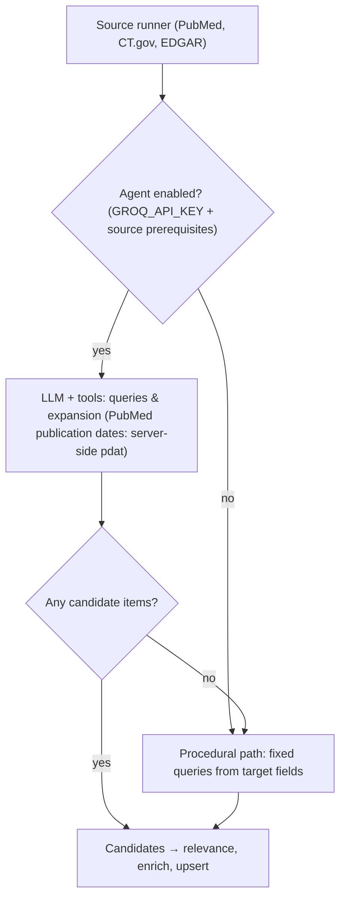

# Compass System Flow and LLM Usage

This document has two layers:

1. **Product / system flow** — who calls what, and where LLM steps sit in the loop.
2. **Scan-time retrieval** — for each external source, whether an LLM expands queries or code uses fixed templates (and what happens when keys are missing).

---

## 1) End-to-end system flow (with LLM touchpoints)

```mermaid
flowchart TB
  User[User in Next.js web app]

  subgraph UI["Next.js App Router"]
    TargetsPage["Watch Targets hub (/targets)"]
    TargetDetail["Target detail (/targets/id)"]
    SettingsPage["Settings (/settings)"]
    ApiScan["POST /api/scan"]
    ApiLookup["POST /api/targets/lookup"]
    ApiSchedule["POST /api/schedule/parse"]
    ApiFetchPage["POST /api/fetch-page"]
  end

  subgraph Convex[Convex backend]
    WT["watchTargets queries/mutations"]
    Scans["scanRuns + scanSourceStatus"]
    RawItems["rawItems upsert/query"]
    Digests["digestRuns + digestItems"]
    Cron["scanSchedule.checkAndTrigger"]
    EmailAction["internal.email.sendDigestEmail"]
  end

  subgraph Sources["External data sources"]
    PubMed[PubMed]
    CTGov[ClinicalTrials.gov]
    Edgar[SEC EDGAR]
    Exa[Exa]
    OpenFDA[openFDA]
    RSS[RSS]
    Patents[PatentsView]
  end

  subgraph LLM[LLM-backed processing]
    L1["LLM #1 target lookup enrichment"]
    L2["LLM #2 schedule parsing"]
    L3["LLM #3 source-agent retrieval loops"]
    L4["LLM #4 relevance filtering"]
    L5["LLM #5 missing summary enrichment"]
    L6["LLM #6 digest synthesis"]
    L7["LLM #7 page text formatting"]
  end

  Resend[Resend email API]

  User --> TargetsPage
  User --> TargetDetail
  User --> SettingsPage

  TargetsPage --> WT
  TargetDetail --> WT
  SettingsPage --> WT

  TargetsPage --> ApiScan
  SettingsPage --> ApiSchedule
  TargetsPage --> ApiLookup
  TargetDetail --> ApiFetchPage

  ApiLookup --> L1
  ApiSchedule --> L2
  ApiFetchPage --> L7

  Cron --> ApiScan
  ApiScan --> Scans
  ApiScan --> PubMed
  ApiScan --> CTGov
  ApiScan --> Edgar
  ApiScan --> Exa
  ApiScan --> OpenFDA
  ApiScan --> RSS
  ApiScan --> Patents

  ApiScan --> L3
  ApiScan --> L4
  ApiScan --> L5
  ApiScan --> RawItems
  ApiScan --> L6
  ApiScan --> Digests

  Digests --> EmailAction
  EmailAction --> Resend
```

### How to read this diagram

- **L1–L7** are logical steps, not separate network services: they run inside Next.js route handlers (and scan-time steps run inside `POST /api/scan`).
- **L3** is “during source runs”: for many sources, an LLM chooses query strings and tool parameters (see §2). It does not replace HTTP calls to PubMed, Exa, etc.; it drives them.
- **L4 → L5** run after each source returns candidates and before / alongside writing `rawItems` (relevance filter, then one-line abstracts where missing).
- **L6** runs when a digest is built from new items for that scan (not on every source row).
- **Convex** holds auth, schedules, persistence, and schedules email after digest creation.

---

## 2) Scan-time query construction: agent vs procedural

Agents share a **mission** string from `buildMission` in `lib/scan/agent-context.ts` (per-target “what to monitor” notes plus optional thumbs up/down snippets). That text steers query expansion; it is not shown as its own box in the diagram above.

### Pattern used by PubMed, ClinicalTrials.gov, and SEC EDGAR

These sources try an **LLM + tools** path first when `GROQ_API_KEY` is set (and when the source’s own API key / prerequisites exist). If the agent returns **no items**, the runner falls back to **deterministic queries** built from watch-target fields (names, aliases, therapeutic scope, etc.).

### Per-source summary (query shaping)

| Source | LLM shapes search queries? | Procedural fallback if agent returns nothing | Notable gates |
|--------|----------------------------|-----------------------------------------------|---------------|
| **PubMed** | Yes — AI SDK `ToolLoopAgent` with `searchPubMed` (`term` / `retmax`); **`esearch` `mindate`/`maxdate`** use NCBI **`YYYY/MM/DD`** + `datetype=pdat`, from `scanOptions.pubmedPubDate` (not the LLM) | Yes — `buildPubmedQuery` in `lib/scan/sources/pubmed.ts` | Agent path needs `PUBMED_API_KEY` and `GROQ_API_KEY` |
| **ClinicalTrials.gov** | Yes — agent + tools | Yes — single API query from name / displayName / alias | Agent needs `GROQ_API_KEY` |
| **SEC EDGAR** | Yes — full-text + company tools; optional LLM-derived company name | Yes — token / company-list matching in `lib/scan/sources/edgar.ts` | Procedural hits can still get LLM filing summaries when `GROQ_API_KEY` is set |
| **Exa** | Yes — `searchExa` tool | No | Needs `EXA_API_KEY` and `GROQ_API_KEY` |
| **Patents (PatentsView)** | Yes — agent + tools | No | Needs `PATENTSVIEW_API_KEY` and `GROQ_API_KEY` |
| **openFDA** | LLM loop exists; tool is a stub | No (always empty until API is wired) | See `lib/scan/sources/openfda-agent.ts` |
| **RSS** | LLM loop exists; tool is a stub | No (always empty until feeds are wired) | See `lib/scan/sources/rss-agent.ts` |
| **BioRxiv** | No | N/A | Stub runner only |

**EDGAR and relevance filter:** items from source `edgar` skip LLM relevance filtering in `POST /api/scan` so curated filings are not dropped by the generic filter.

---

## 3) Where LLMs are used (reference by feature)

### 3.1 Target onboarding and settings

1. `POST /api/targets/lookup`
   - Purpose: infer structured watch target fields from free-text input plus Exa search context.
   - Model: `gpt-4o`.
   - Output: normalized watch target payload (`name`, `displayName`, `aliases`, `type`, `therapeuticArea`, optional `company` and `affiliation`).
2. `POST /api/schedule/parse`
   - Purpose: parse natural-language scheduling instructions into structured schedule fields.
   - Model: `gpt-4o-mini`.
   - Output: `dailyEnabled`, `weeklyEnabled`, time/day fields.

### 3.2 Scan pipeline (after sources return)

Per-source **query** behavior is summarized in §2. After candidates exist:

1. **Source agents** — `lib/scan/sources/*-agent.ts`: tool-calling retrieval (`gpt-4o-mini` for implemented sources).
2. **Relevance filter** — `lib/scan/relevance-filter.ts`: keep/drop against monitoring goal (`gpt-4o-mini`; skipped for EDGAR).
3. **Missing summary enrichment** — `lib/scan/summary-enrichment.ts`: one-sentence abstracts where absent (`gpt-4o-mini`; EDGAR excluded here).
4. **Digest synthesis** — `lib/scan/digest.ts`: executive summary + grouped signals (`gpt-4o`), with rule-based fallback if the key is missing or the call fails.

### 3.3 Source detail formatting

1. `POST /api/fetch-page`
   - Purpose: convert scraped or API text into cleaner plain text.
   - Model: `gpt-4o-mini` (OpenAI chat completions).
   - Output: text cached in `pageContentCache`.

---

## 4) Non-LLM path and fallbacks

- If `GROQ_API_KEY` is unavailable, several steps degrade gracefully:
  - PubMed / ClinicalTrials / EDGAR use **procedural** retrieval when the agent path does not run or returns no items (see §2).
  - Relevance filter returns **unfiltered** items.
  - Summary enrichment is **skipped**.
  - Digest generation uses **rule-based** `generateDigest`.
  - Page formatting returns **extracted raw** text.
- Scan lifecycle and persistence (`scanRuns`, `rawItems`, `digestRuns`) do not hard-depend on LLM success.

---

## 5) Product surface vs implementation

- The `/chat` page exists in navigation but is currently a **placeholder** (no live LLM chat loop).
- Most LLM usage today is in: **retrieval query shaping** (§2), **quality filters and summaries**, **digest synthesis**, and **onboarding / settings** (§3.1).
