# Compass System Flow and LLM Usage

This document describes the end-to-end Compass system flow and highlights exactly where large language models are currently used.

## 1) End-to-end system flow (with LLM touchpoints)

```mermaid
flowchart TB
  User[User in Next.js web app]

  subgraph UI["Next.js App Router"]
    TargetsPage["Watch Targets hub (/targets)"]
    TargetDetail["Target detail (/targets/id)"]
    SettingsPage["Settings (/settings)"]
    ApiScan["POST /api/scan"]
    ApiLookup["POST /api/targets/lookup"]
    ApiSchedule["POST /api/schedule/parse"]
    ApiFetchPage["POST /api/fetch-page"]
  end

  subgraph Convex[Convex backend]
    WT["watchTargets queries/mutations"]
    Scans["scanRuns + scanSourceStatus"]
    RawItems["rawItems upsert/query"]
    Digests["digestRuns + digestItems"]
    Cron["scanSchedule.checkAndTrigger"]
    EmailAction["internal.email.sendDigestEmail"]
  end

  subgraph Sources[External data sources]
    PubMed[PubMed]
    CTGov[ClinicalTrials.gov]
    Edgar[SEC EDGAR]
    Exa[Exa]
    OpenFDA[openFDA]
    RSS[RSS]
    Patents[PatentsView]
  end

  subgraph LLM[LLM-backed processing]
    L1["LLM #1 target lookup enrichment"]
    L2["LLM #2 schedule parsing"]
    L3["LLM #3 source-agent retrieval loops"]
    L4["LLM #4 relevance filtering"]
    L5["LLM #5 missing summary enrichment"]
    L6["LLM #6 digest synthesis"]
    L7["LLM #7 page text formatting"]
  end

  Resend[Resend email API]

  User --> TargetsPage
  User --> TargetDetail
  User --> SettingsPage

  TargetsPage --> WT
  TargetDetail --> WT
  SettingsPage --> WT

  TargetsPage --> ApiScan
  SettingsPage --> ApiSchedule
  TargetsPage --> ApiLookup
  TargetDetail --> ApiFetchPage

  ApiLookup --> L1
  ApiSchedule --> L2
  ApiFetchPage --> L7

  Cron --> ApiScan
  ApiScan --> Scans
  ApiScan --> Sources

  Sources --> PubMed
  Sources --> CTGov
  Sources --> Edgar
  Sources --> Exa
  Sources --> OpenFDA
  Sources --> RSS
  Sources --> Patents

  ApiScan --> L3
  ApiScan --> L4
  ApiScan --> L5
  ApiScan --> RawItems
  ApiScan --> L6
  ApiScan --> Digests

  Digests --> EmailAction
  EmailAction --> Resend
```

## 2) Where LLMs are used today

### 2.1 Target onboarding and settings

1. `POST /api/targets/lookup`
   - Purpose: infer structured watch target fields from free-text input plus Exa search context.
   - Model: `gpt-4o`.
   - Output: normalized watch target payload (`name`, `displayName`, `aliases`, `type`, `therapeuticArea`, optional `company` and `affiliation`).
2. `POST /api/schedule/parse`
   - Purpose: parse natural-language scheduling instructions into structured schedule fields.
   - Model: `gpt-4o-mini`.
   - Output: `dailyEnabled`, `weeklyEnabled`, time/day fields.

### 2.2 Scan pipeline

1. Source-agent orchestration in `lib/scan/sources/*-agent.ts`
   - Purpose: tool-calling retrieval loops for source-specific query expansion and evidence collection.
   - Models: `gpt-4o-mini` (agent/tool calls for PubMed, ClinicalTrials, Exa, Patents, RSS, openFDA, EDGAR helpers).
   - Output: source-specific candidate items (`RawItemInput[]`) before persistence.
2. Relevance filtering in `lib/scan/relevance-filter.ts`
   - Purpose: drop tangential/off-target items before they enter the digest path.
   - Model: `gpt-4o-mini`.
   - Output: boolean keep/drop per item.
3. Missing summary enrichment in `lib/scan/summary-enrichment.ts`
   - Purpose: generate one-sentence summaries for items lacking abstract/full text (except EDGAR).
   - Model: `gpt-4o-mini`.
   - Output: enriched `abstract` values.
4. Digest generation in `lib/scan/digest.ts`
   - Purpose: synthesize executive summary and grouped signals (headline, synthesis, significance, category).
   - Model: `gpt-4o`.
   - Output: `DigestPayload` used to create `digestRuns` and `digestItems`.

### 2.3 Source detail formatting

1. `POST /api/fetch-page`
   - Purpose: convert scraped/plain source text into cleaner human-readable content.
   - Model: `gpt-4o-mini` via OpenAI chat completions endpoint.
   - Output: normalized plain text cached in `pageContentCache`.

## 3) Current non-LLM path and fallbacks

- If OpenAI key is unavailable, several steps degrade gracefully:
  - Relevance filter returns unfiltered items.
  - Summary enrichment is skipped.
  - Digest generation falls back to deterministic rule-based `generateDigest`.
  - Page formatting returns extracted raw text.
- Scan lifecycle and persistence (`scanRuns`, `rawItems`, `digestRuns`) continue without hard dependency on LLM success.

## 4) Notes on product surface vs implementation

- The `/chat` page exists in navigation but is currently a placeholder UI with no active chat inference loop.
- Most LLM usage today is in:
  - ingestion and retrieval quality (source agents),
  - result quality controls (relevance + summaries),
  - digest synthesis and onboarding UX.
